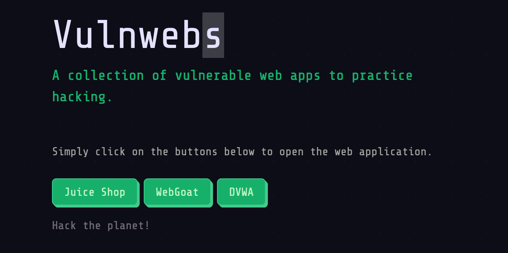

# Vulnwebs

Ansible playbook to run common vulnerable web apps for ethical hacking practice.

The playbook will install the following intentionally vulnerable web applications:

* OWASP Juice Shop
* OWASP WebGoat
* Damn Vulnerable Web Application (DVWA)

**Note: your host machine needs to be either Linux or Mac OS. Windows is not supported by Ansible as a host machine.**

## Running in Vagrant

### Prerequisites

1. [Virtualbox](https://www.virtualbox.org/wiki/Downloads)
2. [Vagrant](https://www.vagrantup.com/downloads.html)
3. [Ansible](https://docs.ansible.com/ansible/latest/installation_guide/intro_installation.html) (>= 2.9) installed on host machine (`pip install --upgrade ansible`)
4. Install the [virtualization collection](https://galaxy.ansible.com/crivetimihai/virtualization) from ansible galaxy (`ansible-galaxy collection install crivetimihai.virtualization`)

### Running the applications

Change into the `vagrant` directory, and run the `vagrant up` command.

```bash
$ cd vagrant
$ vagrant up
```

Once provisioning has completed, visit the landing page where you can choose which application to hack on:

http://10.10.10.10



## Manual Setup

### Prerequisites

1. [Ansible](https://docs.ansible.com/ansible/latest/installation_guide/intro_installation.html) (>= 2.9) installed on host machine (`pip install --upgrade ansible`)
2. Install the [virtualization collection](https://galaxy.ansible.com/crivetimihai/virtualization) from ansible galaxy (`ansible-galaxy collection install crivetimihai.virtualization`)
3. A VM running either [Ubuntu Desktop 18.04](https://ubuntu.com/download/desktop) or [Ubuntu Server 18.04](https://ubuntu.com/download/server) (Minimum 1 vCPU, 2GB RAM)
4. A standard user account in the VM with sudo privileges
5. SSH access from host machine to the VM user specified in step 2 via SSK keys (e.g. `ssh-copy-id user@VM`)
6. A basic understanding of running Ansible playbooks

### Running the applications

Run the `prep.sh` script as follows:

`bash ./prep.sh <VM IP Address> <VM username>`

This will configure the ansible inventory file in this directory with the correct IP address and username for your VM.

Execute the ansible playbook with the following command:

`ansible-playbook -i ./inventory playbook.yml`

>Note: if you do not have passwordless sudo access for your VM user, add the `-K` flag to your `ansible-playbook` command to be prompted for your sudo (become) password:
`ansible-playbook -i ./inventory -K playbook.yml`

## Accessing the applications

Once the ansible play has successfully completed, visit the landing page where you can choose which application to hack on:

http://ip


> Note: replace 'ip' in the above URL with the IP address of your VM

Providing your attacker machine (e.g. Kali) is on the same network, you will be able to enumerate the VM and attack the applications.

Hack The Planet!
